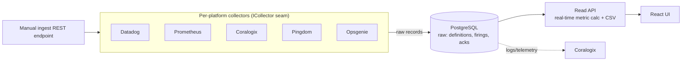
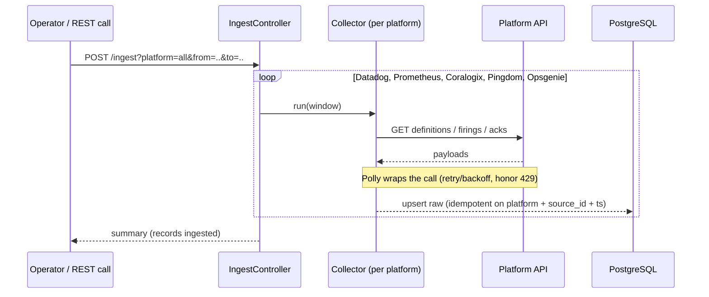
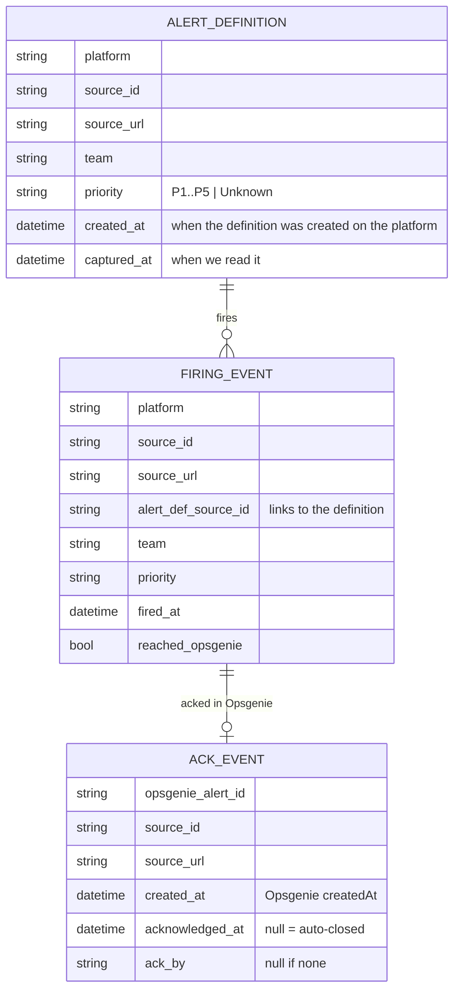

# Alerts Dashboard — Architecture Sketch (DEVOPS-17921)

> Design spike. Nothing here is built (that's DEVOPS-17922). This documents the
> intended shape so the build starts with the seams in the right places. The only
> thing coded in this ticket is the fake-data UI mockup in [`/mockup`](../mockup).

## 1. What it must do

Surface, per team, the alert metrics — **Fired-Total, Fired-Opsgenie,
Acknowledged, MTTA** and **Defined** — across Datadog, Prometheus, Coralogix,
Pingdom and Opsgenie. For the MVP, metrics are computed **in real time** from the
stored raw records (no precomputed aggregate table).

Two constraints drive the design:
1. Add a platform without touching storage or UI -> a per-platform collector seam.
2. Keep the raw records so any window can be recomputed without re-pulling.

## 2. Components



<!-- **The seam:** `ICollector` returns a normalized record shape (section 4). Storage -->
<!-- and UI never see platform-specific payloads, so a 6th platform is one new collector -->
<!-- and nothing downstream changes. -->

```csharp
// The contract, not the implementation.
public interface ICollector {
    string Platform { get; }                       // "datadog", "opsgenie", ...
    Task<IReadOnlyList<RawAlertDefinition>> GetDefinitionsAsync(DateRange w, CancellationToken ct);
    Task<IReadOnlyList<RawFiringEvent>>     GetFiringsAsync(DateRange w, CancellationToken ct);
    Task<IReadOnlyList<RawAckEvent>>        GetAcksAsync(DateRange w, CancellationToken ct); // Opsgenie v1
}
```

## 3. Ingestion sequence

Ingestion is triggered manually via a REST endpoint for the MVP (no scheduler).



Ingestion fans out to **all five collectors** by default (`platform=all`); pass a
single platform to ingest just one. Idempotency: raw upserts key on
`(platform, source_id, event_ts)` so a re-run never double-counts. Metrics are
computed on read, so there is no aggregate to rebuild.

## 4. Data model

Three raw tables. Metrics are calculated in real time from them — there is **no**
stored `(team, PI)` aggregate table in the MVP.



- **Raw** (`alert_definition`, `firing_event`, `ack_event`) retained for the full
  query window so any range can be recomputed without re-pull. Schema holds **all**
  priorities though v1 UI focuses on P1 (P2-P5 non-breaking later).
- **Metrics** (Fired-Total, Fired-Opsgenie, Acknowledged, MTTA, Defined) are
  computed by the read API directly over these rows per team and date range.

See [`stack-choice.md`](stack-choice.md) for the runtime and [`risks.md`](risks.md)
for rate-limit / retention / volume / real-time-calc risks.
