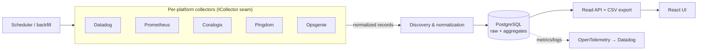
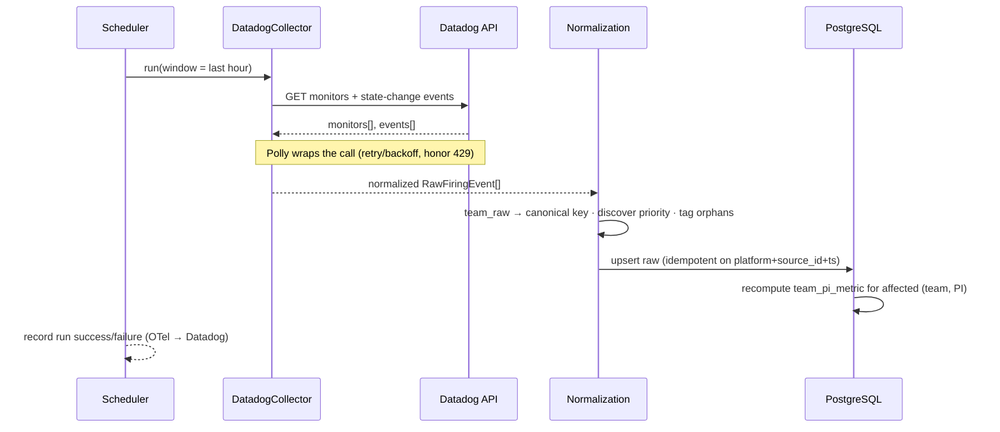
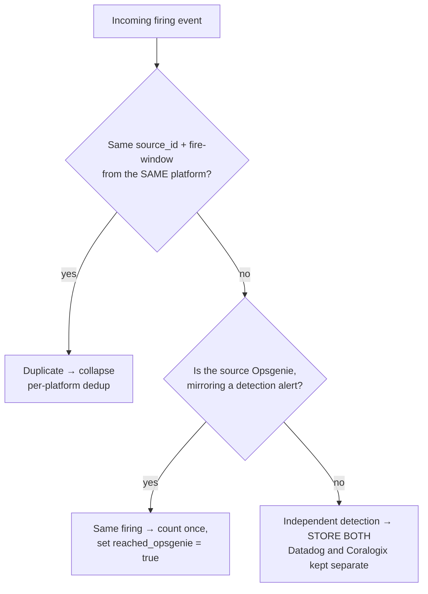
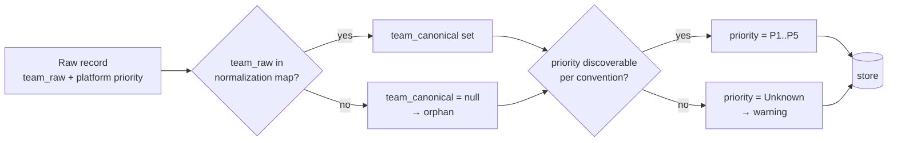
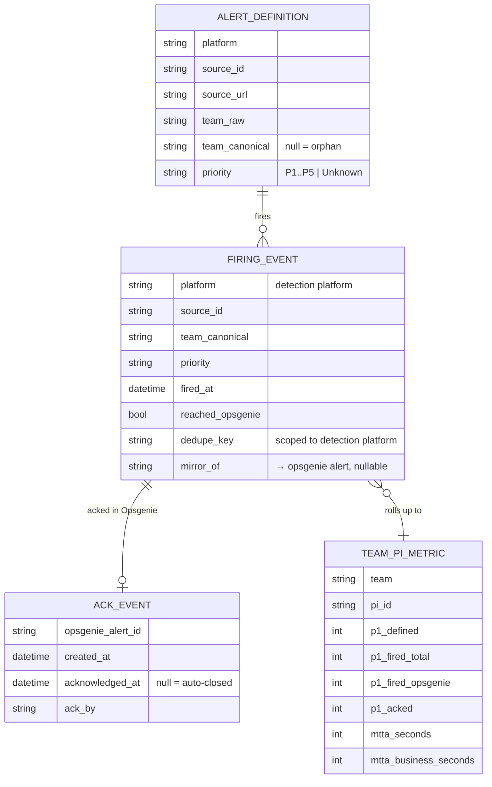

# Alerts Dashboard — Architecture Sketch (DEVOPS-17921)

> Design spike. Nothing here is built (that's DEVOPS-17922). This documents the
> *intended* shape so the build starts with the seams in the right places. The
> only thing coded in this ticket is the fake-data UI mockup in [`/mockup`](../mockup).

## 1. What it must do

Per `(team, PI)`, surface five P1 metrics — **P1-Defined, P1-Fired-Total,
P1-Fired-Opsgenie, P1-Acknowledged, P1-MTTA** — across Datadog, Prometheus,
Coralogix, Pingdom and Opsgenie, plus all-teams aggregates, an orphan-alerts view,
scheduled ingestion + backfill, and CSV export. A **PI** is a configurable 6-week
window.

Two constraints drive the design:
1. **Add a platform without touching storage or UI** → a per-platform collector seam.
2. **Recompute a PI without re-pulling from sources** → keep raw records, compute on top.

## 2. Components



**The seam:** `ICollector` returns a **normalized record shape** (§5). Discovery,
storage and UI never see platform-specific payloads → a 6th platform is one new
collector, nothing downstream changes.

```csharp
// The contract, not the implementation.
public interface ICollector {
    string Platform { get; }                       // "datadog", "opsgenie", ...
    Task<IReadOnlyList<RawAlertDefinition>> GetDefinitionsAsync(DateRange w, CancellationToken ct);
    Task<IReadOnlyList<RawFiringEvent>>     GetFiringsAsync(DateRange w, CancellationToken ct);
    Task<IReadOnlyList<RawAckEvent>>        GetAcksAsync(DateRange w, CancellationToken ct); // Opsgenie v1
}
```

## 3. Ingestion sequence



Idempotency: raw upserts key on `(platform, source_id, event_ts)` so a re-run or
resumed backfill never double-counts. Aggregates are derived → safe to recompute
any time.

## 4. Deduplication logic

The rule has two distinct cases — getting this wrong skews `P1-Fired-Total` and the
routing-compliance ratio:



- **Per-platform dedup (case 1):** within one platform (e.g. Datadog re-notifying
  the same monitor), collapse repeats by `(platform, source_id, fire_window)`.
- **Detection → Opsgenie mirror (case 2):** Opsgenie is the *routing/notification*
  layer. A Datadog/Coralogix alert mirrored into Opsgenie is the **same firing** —
  count it **once** for `P1-Fired-Total` and set `reached_opsgenie = true` (this is
  what the compliance ratio measures).
- **Cross-detection — keep both (case 3):** if Datadog **and** Coralogix each
  independently detect a "similar" condition, they are **separate alert
  definitions** on separate platforms → **store both**, do **not** cross-dedup.
  We only collapse the trivial same-alert-mirrored-to-Opsgenie case.

The `dedupe_key` therefore scopes to *detection platform* (so it never merges
Datadog with Coralogix) and a `mirror_of` link records the detection→Opsgenie pairing.

## 5. Discovery & normalization



Team identity and priority are discovered from each platform's own metadata (no
central manual catalog). Unrecognized teams → **orphans**; undiscoverable priority →
**Unknown**. Both are surfaced in the UI, never dropped, so teams fix tagging at the
source — and the normalization map is editable without redeploy.

## 6. Data model



- **Raw** (`alert_definition`, `firing_event`, `ack_event`) retained **≥ 2 PIs / 12
  weeks** so PIs recompute without re-pull. Schema holds **all** priorities though
  v1 UI shows P1 (P2–P5 non-breaking later).
- **Computed** `team_pi_metric` is one row per `(team, PI)`. All-teams
  **average / median / P90** per metric per PI are computed from it (median/P90
  stored even though v1 UI surfaces the average).

## 7. Config shape (structure only — editable without redeploy)

```jsonc
{
  "piCalendar": [ { "id": "PI-2026-1", "startDate": "2026-01-05" } ],     // 6-week windows
  "teamNormalization": {                                                  // platform label → canonical key
    "datadog":   { "<monitor team tag>": "<canonicalKey>" },
    "opsgenie":  { "<opsgenie team name>": "<canonicalKey>" }
  },
  "priorityConventions": {                                                // how each platform encodes priority
    "datadog":   { "tagKey": "priority", "fallbackField": "priority" },
    "coralogix": { "severityField": "severity" },
    "pingdom":   { "default": "P1", "overrideTag": "priority" },
    "opsgenie":  { "field": "priority" }
  },
  "mtta": { "businessHoursOnly": false, "timezone": "UTC" }               // FR-3 MTTA variant
}
```

## 8. Non-functionals

- **Freshness:** stable within 1h (hourly firing pulls + cheap aggregate recompute).
- **Auditability:** every aggregate traces to the raw rows it came from.
- **Observability:** ingestion run success/failure, per-platform API error rates,
  and discovery warnings emit via **OpenTelemetry → Datadog**.
- **Access:** internal-only via Tipalti SSO, read-only in v1.

See [`stack-choice.md`](stack-choice.md) for the runtime and [`risks.md`](risks.md)
for rate-limit / retention / volume risks.
