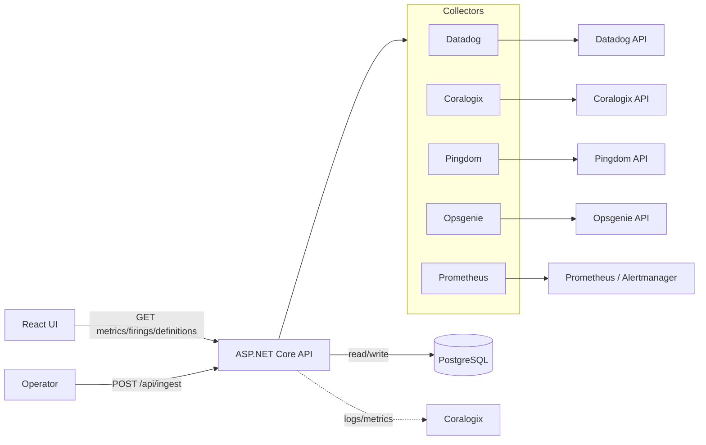
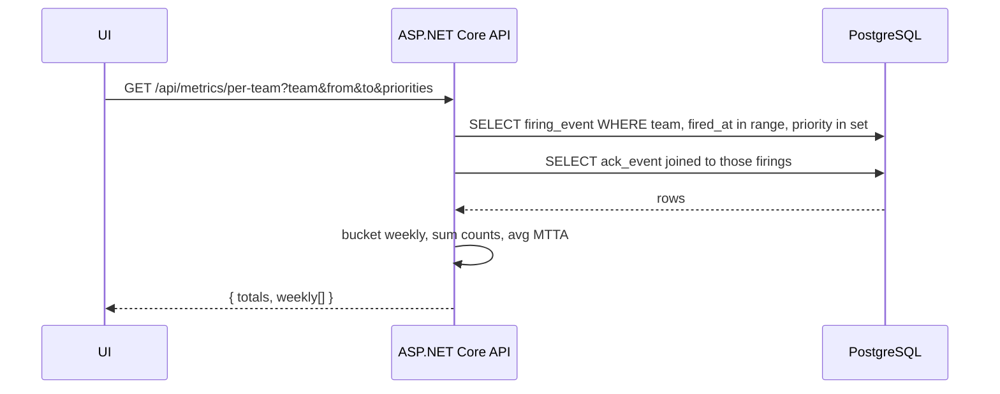
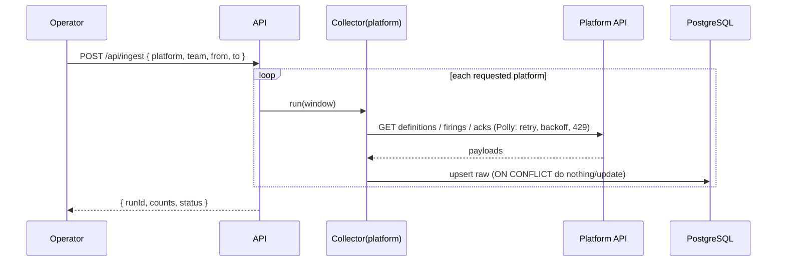

# Alerts Dashboard — Backend Implementation Guide (personal notes)

Practical gist of what the backend needs: stack, data model, our REST endpoints
(with request/response shapes and behavior), the third-party APIs each collector
calls, and how the pieces talk. Scoped to the MVP: manual ingestion trigger,
real-time metric calculation, no cache, Coralogix telemetry, SSO.

> Endpoint paths/fields below are the contract the React app already expects (it is
> built against these shapes with fake data). Third-party API versions are
> representative — confirm against current vendor docs when wiring each collector.

---

## 1. Stack

- **Runtime:** C# / .NET 10 ASP.NET Core (Web API).
- **DB:** PostgreSQL (Npgsql + EF Core for migrations/writes, Dapper for hot reads).
- **Resilience:** Polly on every outbound platform call (retry, backoff, honor 429).
- **Telemetry/logs:** Coralogix + `Microsoft.Extensions.Logging`.
- **Auth:** Tipalti SSO (the UI is read-only; the ingest endpoint is operator-only).
- **Hosting:** AWS EKS + Helm + Argo CD. Secrets via AWS Secrets Manager.
- **Ingestion:** no scheduler — a manual `POST /api/ingest`.
- **Metrics:** computed in real time from raw rows (no aggregate table).

---

## 2. System overview



Two flows: **ingest** (operator triggers, collectors pull from platforms, raw rows
written) and **read** (UI asks for metrics, API computes them from raw rows on the
fly).

---

## 3. Data model (PostgreSQL)

Three raw tables. No aggregate table.

```sql
create table alert_definition (
  id              bigserial primary key,
  platform        text not null,            -- datadog|prometheus|coralogix|pingdom|opsgenie
  source_id       text not null,            -- platform's monitor/alert/check id
  source_url      text not null,
  team            text not null,
  priority        text not null,            -- P1..P5 | Unknown
  created_at      timestamptz not null,     -- when created on the platform
  captured_at     timestamptz not null,     -- when we read it
  unique (platform, source_id)
);

create table firing_event (
  id                  bigserial primary key,
  platform            text not null,
  source_id           text not null,        -- platform's event id
  source_url          text not null,
  alert_def_source_id text,                 -- links to alert_definition.source_id
  team                text not null,
  priority            text not null,
  fired_at            timestamptz not null,
  reached_opsgenie    boolean not null default false,
  unique (platform, source_id, fired_at)    -- idempotent upsert key
);

create table ack_event (
  id                bigserial primary key,
  opsgenie_alert_id text not null,
  source_id         text not null,
  source_url        text not null,
  created_at        timestamptz not null,   -- Opsgenie createdAt
  acknowledged_at   timestamptz,            -- null = auto-closed, no human ack
  ack_by            text,
  unique (opsgenie_alert_id)
);

-- indexes for the real-time read path
create index ix_firing_team_time on firing_event (team, fired_at, priority);
create index ix_def_team_created on alert_definition (team, created_at);
create index ix_ack_created on ack_event (created_at);
```

Metric definitions (computed over a `[from,to)` window and a priority set):
- **Fired (Total)** = count of `firing_event`.
- **Reached Opsgenie** = count where `reached_opsgenie = true`.
- **Acknowledged** = count of `ack_event` with non-null `acknowledged_at`.
- **MTTA (min)** = avg(`acknowledged_at - created_at`) over acked `ack_event`.
- **Defined** = count of `alert_definition` with `created_at < week_end` (for the
  over-time series).

---

## 4. Our REST API

Base path `/api`. All read endpoints are SSO-gated and read-only. Dates are ISO
(`yyyy-mm-dd`); `priorities` is a comma list (default `P1`).

### GET /api/teams
List of canonical team keys (drives the team dropdowns).
```json
["vulcan", "argus", "dbops", "atlas", "hermes"]
```

### GET /api/me
Current SSO user for the profile page.
```json
{ "name": "Giorgi Kumelashvili", "email": "giorgi.kumelashvili@tipalti.com", "role": "viewer", "signIn": "Tipalti SSO (SAML)" }
```

### GET /api/metrics/per-team
`?team=vulcan&from=2026-03-09&to=2026-06-01&priorities=P1`
Weekly series plus totals for the Per-team page (cards + both charts).
```json
{
  "team": "vulcan",
  "from": "2026-03-09",
  "to": "2026-06-01",
  "priorities": ["P1"],
  "totals": { "firedTotal": 84, "firedOpsgenie": 71, "acked": 58, "mttaMinutes": 19 },
  "weekly": [
    { "weekStart": "2026-03-09", "firedTotal": 7, "firedOpsgenie": 6, "acked": 5, "mttaMinutes": 18 }
  ]
}
```

### GET /api/firings
`?team=vulcan&from=..&to=..&priorities=P1`
Underlying firing rows for the Per-team table.
```json
[
  {
    "sourceId": "datadog-vulcan-0", "platform": "datadog",
    "name": "HighErrorRate-checkout [vulcan]", "priority": "P1",
    "firedAt": "2026-03-10T08:00:00Z", "reachedOpsgenie": true,
    "acknowledged": true, "sourceUrl": "https://app.datadoghq.com/monitors/123"
  }
]
```

### GET /api/definitions
`?team=all|<team>` — list for the Defined alerts table.
```json
[
  { "sourceId": "coralogix-def-3", "platform": "coralogix", "team": "argus",
    "name": "DBReplicaLag [argus]", "priority": "P1",
    "createdAt": "2026-01-14T00:00:00Z", "sourceUrl": "https://..." }
]
```

### GET /api/definitions/series
`?team=all|<team>&from=..&to=..` — weekly count of definitions that exist at each
week (the over-time chart).
```json
[ { "weekStart": "2026-03-09", "count": 22 } ]
```

### CSV export
Same data endpoints with `?format=csv` return `text/csv` (or the UI can build the
CSV client-side from the JSON, which is what the mockup does). Filenames like
`per-team_vulcan_02-06-2026.csv`.

### POST /api/ingest  (operator-only)
Trigger ingestion. Idempotent and resumable.
```
POST /api/ingest
{ "platform": "datadog" | "all", "team": "vulcan" | "all", "from": "2026-03-01", "to": "2026-06-01" }
```
```json
{ "runId": "ing-1042", "platform": "datadog", "definitions": 412, "firings": 138, "acks": 0, "durationSec": 38, "status": "success" }
```

### GET /api/ingest/status
Last successful ingest per platform (freshness, since there is no scheduler).
```json
[ { "platform": "datadog", "lastIngestAt": "2026-06-02T09:52:00Z", "status": "success" } ]
```

---

## 5. Endpoint behavior

Read path (metrics computed live, no aggregate table):



Ingest path (fan-out per platform, Polly-wrapped, idempotent upserts):



---

## 6. Third-party APIs per collector

For each platform: base, auth, what we read, and how it maps to our raw tables.
Confirm versions/paths against current docs.

### Datadog
- Base `https://api.datadoghq.com`. Auth headers `DD-API-KEY`, `DD-APPLICATION-KEY`.
- **Definitions:** `GET /api/v1/monitor` → list of monitors. Map `id`→source_id,
  `name`, `tags` (`team:*`, `priority:*`)→team/priority, `created`→created_at,
  monitor URL→source_url.
- **Firings:** `GET /api/v1/events?sources=alert&start=&end=` (or the v2 Events API)
  → state-change events. Map event id→source_id, `date_happened`→fired_at, link to
  the monitor via `monitor_id`.

### Opsgenie
- Base `https://api.opsgenie.com`. Auth header `Authorization: GenieKey <key>`.
- **Firings + acks:** `GET /v2/alerts?query=...&createdAt>=...` → alerts. Map
  `id`→opsgenie_alert_id, `createdAt`→created_at, `acknowledged`/`report.ackTime`.
- **Ack detail:** `GET /v2/alerts/{id}/logs` → find the human acknowledge action →
  acknowledged_at, ack_by.
- **Teams:** `GET /v2/teams` → team ownership.
- This is the source for `reached_opsgenie` (an alert present here reached Opsgenie)
  and for all ack/MTTA data. Reuse `Tipalti.AlertProxyService`'s Opsgenie client.

### Coralogix
- Base region-specific, e.g. `https://api.<region>.coralogix.com`. Auth
  `Authorization: Bearer <api key>`.
- **Definitions:** Alerts API → alert definitions. Map id/name/severity→priority,
  owning group→team.
- **Firings:** triggered-alerts / DataPrime query for alert events in the window →
  fired_at, source_id. Also the **mirror source** for Prometheus firing history.

### Pingdom
- Base `https://api.pingdom.com/api/3.1`. Auth `Authorization: Bearer <token>`.
- **Definitions:** `GET /checks` → checks. Map `id`→source_id, `name`, tags→team,
  default priority P1 unless a priority tag overrides.
- **Firings:** `GET /checks/{id}/results` or the actions/incidents feed → down
  events → fired_at.

### Prometheus / Alertmanager
- Base internal (cluster network). Auth internal.
- **Definitions:** Prometheus `GET /api/v1/rules` → alerting rules. Map
  labels (`team`, `severity`/`priority`).
- **Firings:** Alertmanager `GET /api/v2/alerts` gives only *active* alerts; history
  is usually not retained → take firing **history from the Coralogix mirror**.

Mapping summary: every collector produces the normalized shape the raw tables
expect — `platform, source_id, source_url, team, priority, created_at/fired_at`,
and acks only from Opsgenie.

---

## 7. Cross-cutting

- **Auth:** Tipalti SSO in front; read endpoints require a signed-in viewer; the
  ingest endpoint requires an operator scope.
- **Polly:** wrap each outbound HTTP call — retry with exponential backoff, honor
  `Retry-After` on 429, circuit-break a platform that is down so a backfill pauses.
- **Idempotency:** raw upserts use `ON CONFLICT` on the unique keys above, so a
  re-run or interrupted backfill never double-counts. Record last-ingest timestamps.
- **Secrets:** platform API keys + DB connection string come from AWS Secrets
  Manager via External Secrets; nothing in the repo.
- **Telemetry:** ingest run success/failure, per-platform API error rates, and
  request metrics go to Coralogix; keep stdout logs as a fallback.

---

## 8. Deferred (known gaps, document but skip for MVP)

- **Deduplication** of an alert mirrored across detection platforms and into
  Opsgenie (can inflate Fired-Total).
- **Discovery / normalization** of team names and priorities across platforms
  (same team labeled differently fragments its numbers; undiscoverable values are
  not yet surfaced as orphans).
- **Scheduling** (currently manual trigger only).
- **Aggregate/materialized tables** if the real-time queries get slow at scale.
